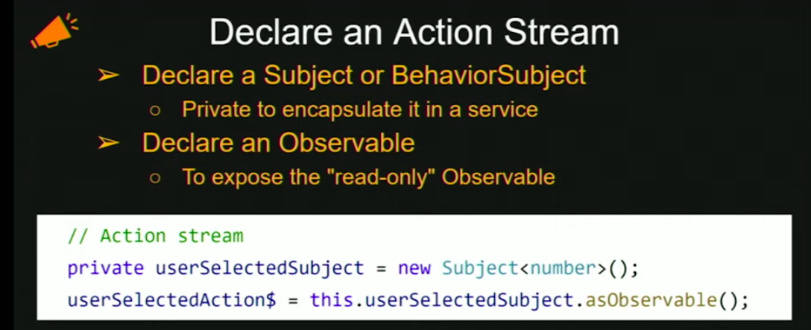
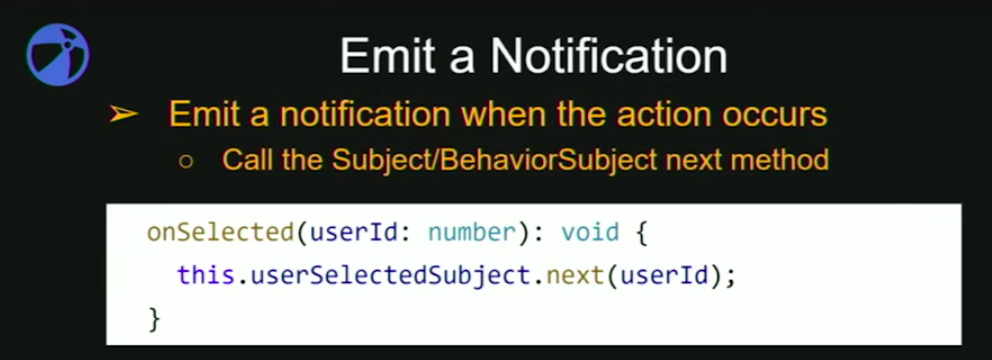
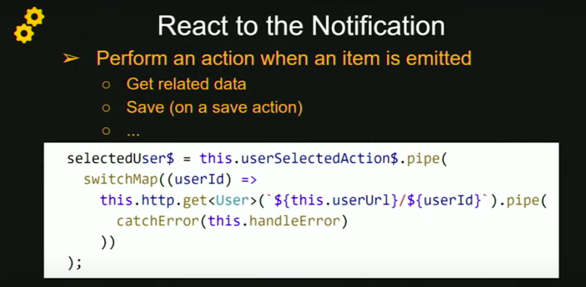
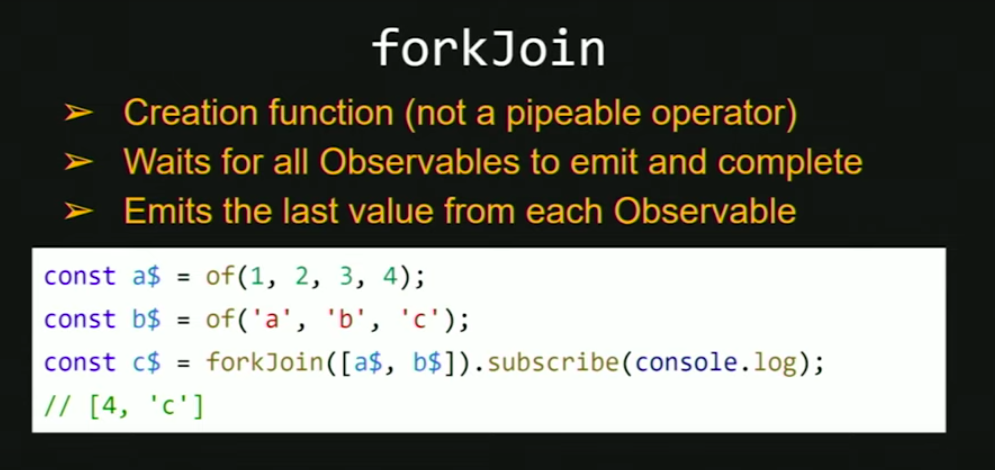
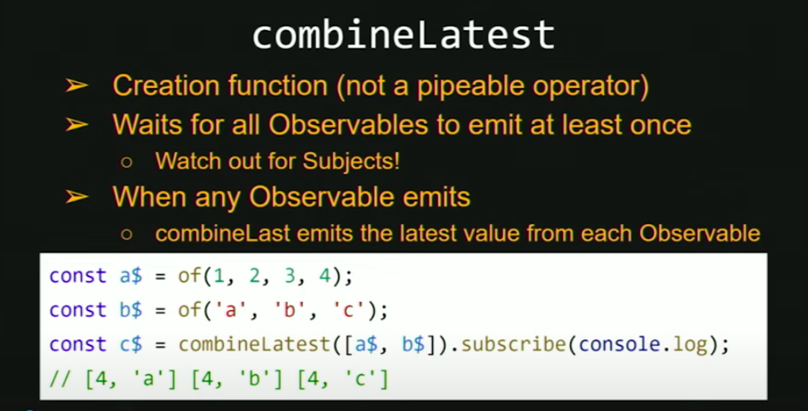
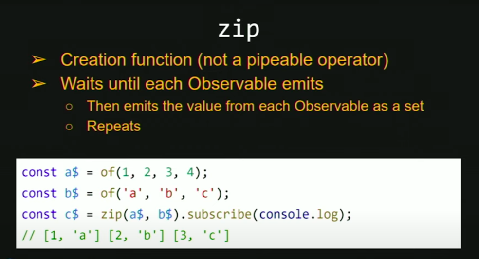
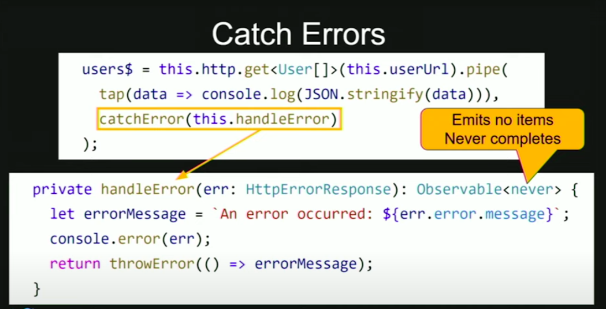

# RxJS Best Practices

## Go Reactive

1. Declare
2. Emit
3. Notify







## concatMap

- Emission are processed sequentially, one at a time
- order matters
- Ex. insert update delete operation

```javascript
todos$ = this.userSelectionAction$.pipe(
  concatMap(userId => this.http.get(`${this.BASE_URL}/${userId}`))
)
```

## mergeMap

- Emission are processed concurrently (often more performant)
- order dosn't matters
- Parallel request

```javascript
todos$ = this.userSelectionAction$.pipe(
  mergeMap(userId => this.http.get(`${this.BASE_URL}/${userId}`))
)
```

## mergeMap

- Latest vaue emitted
- previous pending request canceled
- Ex. typeahead

```javascript
todos$ = this.userSelectionAction$.pipe(
  switchMap(userId => this.http.get(`${this.BASE_URL}/${userId}`))
)
```

## forkJoin



## combineLatest



## zip



## catchError


