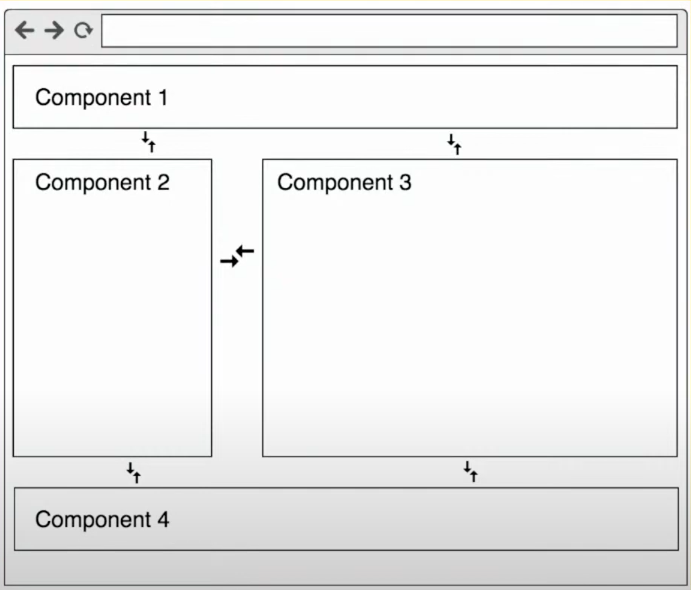
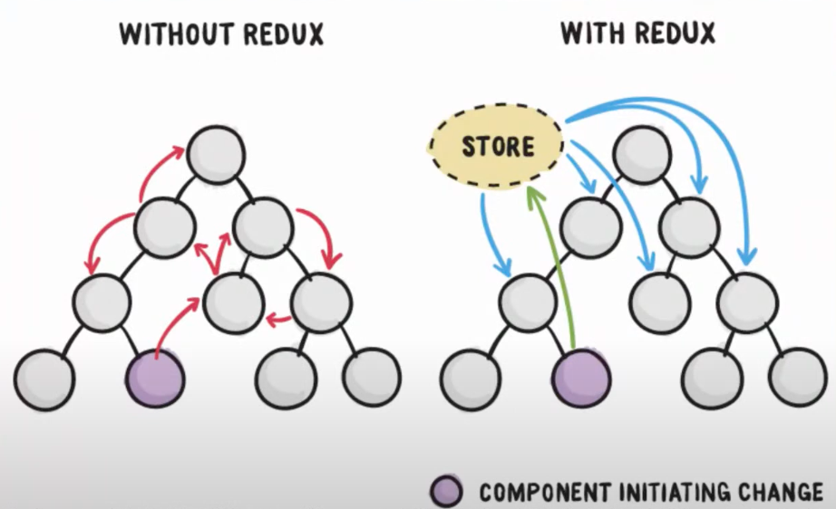
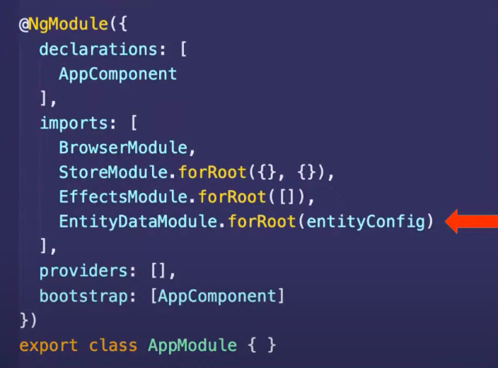
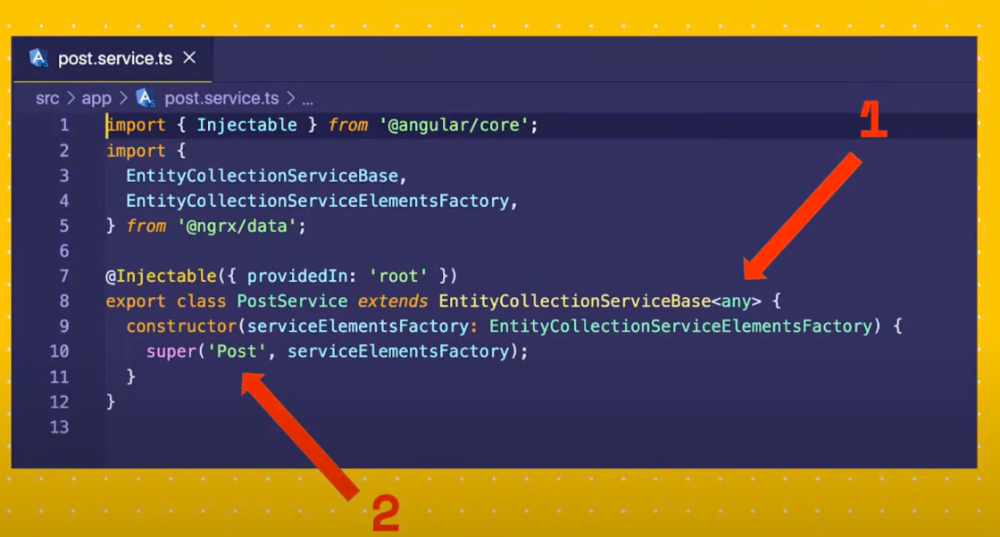
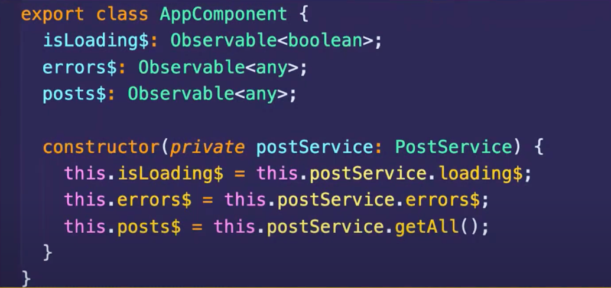
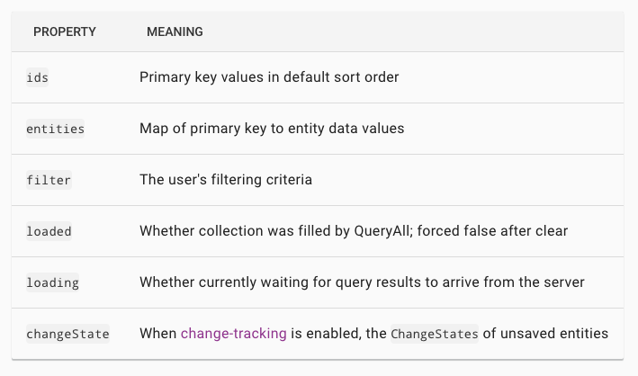
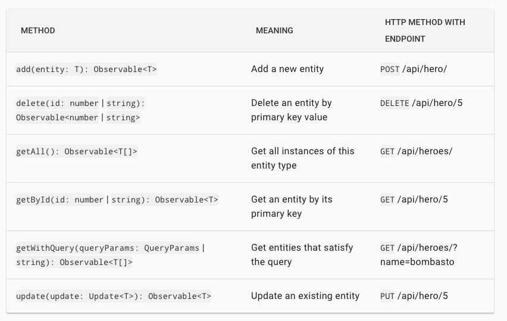

# NgRx Data

Abstraction over NgRx Entity





```
npm i @ngrx/store
npm i @ngrx/effects
npm i @ngrx/entity
npm i @ngrx/data
```

## Setup

Inside Root Module



Define Entities


## Last step - update service you used to have



## Now Enjoy the service ( from component )



```javascript
constructor(private postService: PostService) {}

ngOnInit() {
  // Get all posts
  this.postService.entities$

  // add Post
  this.postService.add(post);

  // Delete Post
  this.postService.delete(postId);

  // Get Post
  this.postService.getById(postId);

  // Update Post
  this.postService.update(post);
}
```

Available properties



Available Methods



## Setup with lazy loaded module ( 99% time you want to use this )

```javascript
// app.module.ts

@NgModule({
  imports: [
    StoreModule.forRoot({}),
    StoreRouterConnectingModule.forRoot(),
    EffectsModule.forRoot([]),
    EntityDataModule.forRoot(entityConfig),
  ]
})

// entity-metadata.ts
import { EntityMetadataMap, EntityDataModuleConfig } from '@ngrx/data';

const entityMetadata: EntityMetadataMap = {
  entityname: 'Post'
};

const pluralNames = {};

export const entityConfig: EntityDataModuleConfig = {
  entityMetadata,
  pluralNames,
};
```

## Step 1 - Register Entity Data Service in Lazy loaded module

```javascript
// Inside lazy loaded module
// user.module.ts
export const userFeatureKey = 'user-ngrx-data';

export const entityMetadata: EntityMetadataMap = {
  [userFeatureKey]: {
    entityDispatcherOptions: {
      optimisticUpdate: true,
    },
  },
};

export class UsersModule {
  constructor(
    private eds: EntityDefinitionService,
    private entityDataService: EntityDataService,
    private userDataService: UserDataService,
  ) {
    this.eds.registerMetadataMap(entityMetadata);

    this.entityDataService.registerService(
      userFeatureKey,
      this.userDataService,
    );
  }
}
```

## Step 2 - Create Entity Data Service

```javascript
// user-data.service.ts
@Injectable()
export class UserDataService extends DefaultDataService<any> {
  API_URL = 'https://jsonplaceholder.typicode.com/users';

  constructor(http: HttpClient, httpUrlGenerator: HttpUrlGenerator) {
    super(userFeatureKey, http, httpUrlGenerator);
  }

  getAll(): Observable<UserInterface[]> {
    return this.http.get<UserInterface[]>(`${this.API_URL}`);
  }

  add(user): Observable<UserInterface> {
    return this.http.post<UserInterface>(`${this.API_URL}`, user);
  }

  update(user): Observable<UserInterface> {
    return this.http.put<UserInterface>(
      `${this.API_URL}/${user.id}`,
      user.changes,
    );
  }

  delete(userId): Observable<any> {
    return this.http.delete(`${this.API_URL}/${userId}`);
  }

  // // to make call to backend, in our case it's not required as we are using resolver to load this module
  // getById(postId) {
  //   return this.http.get(`${this.API_URL}/${postId}`);
  // }
}
```

## Step 3 - Create servive use used to create but extend `EntityCollectionServiceBase` so you get hold on entiy collection proprty and methods

```javascript
// user.service.ts

@Injectable({
  providedIn: 'root',
})
export class UserService extends EntityCollectionServiceBase<Post> {
  constructor(serviceElementsFactory: EntityCollectionServiceElementsFactory) {
    super(userFeatureKey, serviceElementsFactory);
  }

  getUserByIdFromCache(userId) {
    return this.entities$.pipe(
      map(users => {
        return users.find(user => user.id === +userId);
      }),
    );
  }

  // Add All your business logic here
}
```

## Step 4 - Enjoy The Service From component

```javascript
constructor(private userService: UserService) {}

ngOnInit() {
  this.userService.entities$;
  this.userService.add(user);
  this.userService.update(user);
  this.userService.delete(userId);
}
```

## Provide a custom configuration ( url )

First, create a custom configuration object of type DefaultDataServiceConfig :

```javascript
const defaultDataServiceConfig: DefaultDataServiceConfig = {
  root: 'https://my-api-domain.com:8000/api/v1',
  timeout: 3000, // request timeout
};

// Provide it in an eagerly-loaded NgModule such as app.module.ts
@NgModule({
  providers: [{ provide: DefaultDataServiceConfig, useValue: defaultDataServiceConfig }]
})
```

## Resources

https://www.youtube.com/watch?v=alXyNfxmTjw
