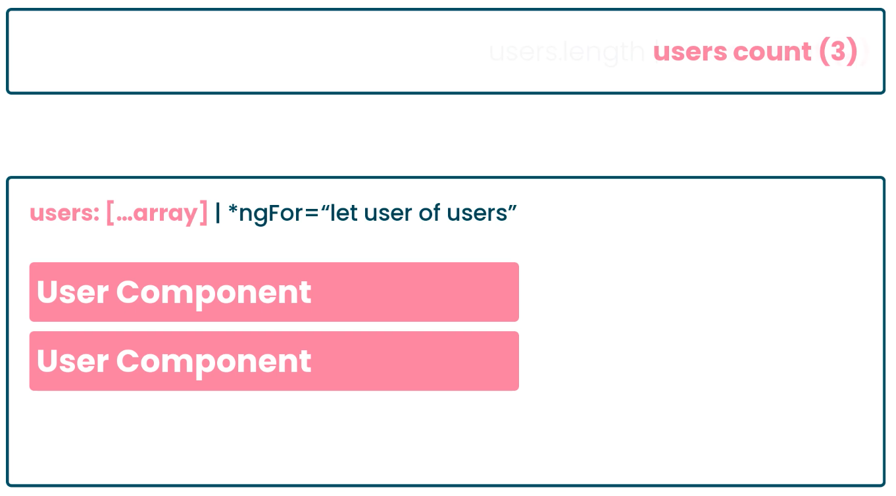
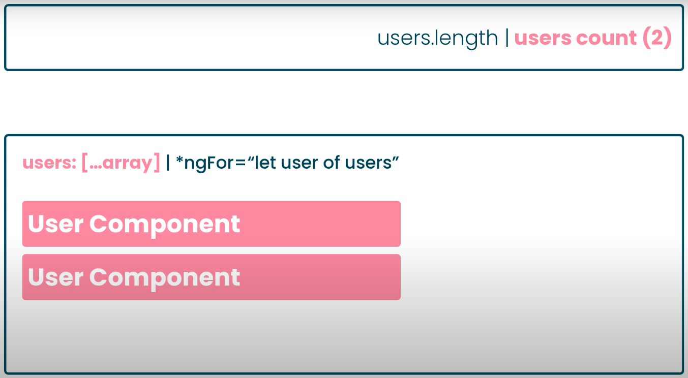
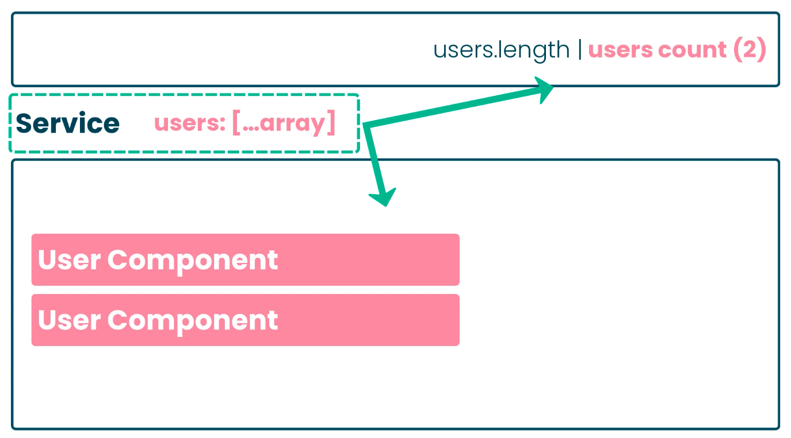

## UI State

1. Persisted State ( data from ackend )
2. Url State ( param, query, data )
3. Client State ( which tab is opened )
   State that not persisted to backend
4. Local UI State (Checkbox checked, Button enabled)

## Url State

https://hs2504785.github.io/ngdemos/crud/posts

https://hs2504785.github.io/ngdemos/crud/posts/view/1

## Local UI State / Component State

```javascript
// State 1
@Component({
  selector: 'app-home',
  templateUrl: './home.component.html',
  styleUrls: ['./home.component.scss'],
})
export class HomeComponent implements OnInit {
  isVisible = false;
  constructor() {}
}

// State 2
@Component({
  selector: 'app-home',
  templateUrl: './home.component.html',
  styleUrls: ['./home.component.scss'],
})
export class HomeComponent implements OnInit {
  isVisible = true;
  constructor() {}
}
```

We compose state in our store

Store help with ...

```
CRUD
observe changes to new state changes
```

## Do we really need Store

https://blog.strongbrew.io/do-we-really-need-redux/

Caching API Response - I guess not ( some existing trick mihght be enough )

```javascript
fetchUsers(): Observable<User[]> {
    ...
    return this.httpClient.get('').pipe(shareReplay(1));
}

// Component 1
this.userService.fetchUsers().subscribe();

// Component 2
this.userService.fetchUsers().subscribe(); // no api call
```

## When we want to Use Store

- Storing state (like the value of a search filter so it’s still available when the user navigates back to a certain grid)
- Sharing state between components that have their own route, and thus won’t have a parent component to pass them the state through inputs or properties
- Optimistic updates: Check this article
- Real-time updates: Check this article
- When we want undo/redo logic
- When we want to keep track of all the state changes and debug them with awesome tooling (Redux devtools)
- When we want an organised way of handling session storage or localstorage.

## Why Store





## Store

```javascript
{
  users: [],
  posts: [],
  orders: []
}
```

## No Store

- Small project / mvp
- Shared component library

## Must use Store

- Big Application
