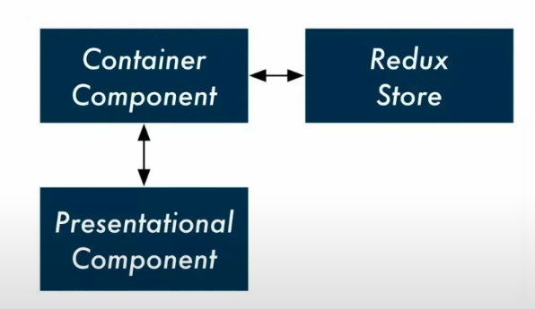
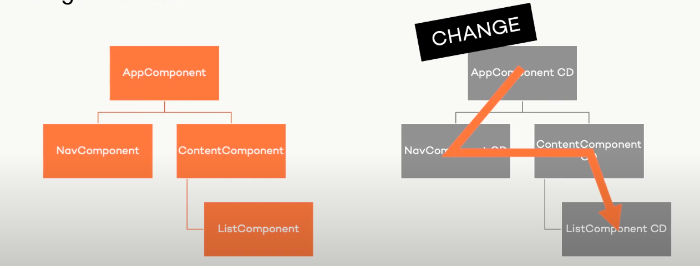

## Change Detection

Reduce required computation during runtime

- Calculations
- Painting
- Layouting
- Change Detection

## Optimize Change Detection

- OnPush and immutability
- Pipe instead of methods in template
- Caching
- trackBy in ngFor
- Detach change detection ( run outside angular zone )

## OnPush Change Detection

Only re-render templates if:

- @Input change
- Event from the component or one of it's children
- Explicit trigger of change detection ( detectChanges/markForCheck )

```javascript
@Component({
  changeDetection: ChangeDetectionStrategy.OnPush,
})
```

## Design for immutability

- Always update state in immutable ways
- Get state from Store
- Pass state to presentation component through async pipe



## Using Pipe instead of method in template

- Methods get evaluated on every tick
- Pure pipe get evaluated on every input change

### Soln

- Use OnPush change detection strategy
- Use async pipe instead of template method
- Use Pipe instead of template method

## Cache value from pure pipe and function

Memoization

```javascript
npm i memo-decorator --save

// with angular pipe
import memo from 'memo-decorator';

@memo()
transform() {

}
```

## Use trackBy in ngFor

- Use trackBy fro the list that get modified dynamically

## For heavy computation detach Change Detection

Only re-render whwn needed

- mousemove, mousehover
- scroll
- drag
- requestAnimationFrame
- setInterval

```javascript
@Input()
set todoIntem(v: TodoInterface) {
  this._todoItem = v;
  this.cd.detectChanges();
}

constructor(private cd: ChangeDetectorRef) {}

ngAfterViewInit() {
  this.cd.detach();
}
```

# Change Detection

By default - each change in your application leads to...

- A single CD cycle
- From top to bottom
- Unidirectional ( no cycles allowed )



## How to Avoid CD

Reduce duration of CD cycle

- Reduce amount of bindings
- Avoid bindings to getters and functions

```javascript
// always use
@Component({
  changeDetection: ChangeDetectionStrategy.OnPush,
})
```

Keep CD cycle < 16ms

## Profiling CD

https://dmitrymogilko.medium.com/profiling-angular-change-detection-c00605862b9f

```javascript
// main.ts
platformBrowserDynamic()
  .bootstrapModule(AppModule)
  .then(moduleRef => {
    const applicationRef = moduleRef.injector.get(ApplicationRef);
    const componentRef = applicationRef.components[0];
    // allows to run `ng.profiler.timeChangeDetection();`
    enableDebugTools(componentRef);
  });

// From console
ng.profiler.timeChangeDetection();

// Parameter {record: true} will generate CPU profile in JavaScript Profiler tab
ng.profiler.timeChangeDetection({ record: true });
```

## Measure change detection run for a single component

```javascript
// 1
export class AppModule {
  constructor(applicationRef: ApplicationRef) {
    const originalTick = applicationRef.tick;
    applicationRef.tick = function () {
      const windowPerfomance = window.performance;
      const before = windowPerfomance.now();
      const retValue = originalTick.apply(this, arguments);
      const after = windowPerfomance.now();
      const runTime = after - before;
      window.console.log('CHANGE DETECTION TIME', runTime);
      return retValue;
    };
  }
}

// 2 - just add ngAfterViewChecked life cycle hook
ngAfterViewChecked() {
  console.log('Change detection triggered!');
}
```

## How `runOutsideAngular` might reduce change detection calls in your app

https://medium.com/@krzysztof.grzybek89/how-runoutsideangular-might-reduce-change-detection-calls-in-your-app-6b4dab6e374d#

```javascript
// prob
this.interval = window.setInterval(() => {
    this.setNextColor()
    this.paint();
}, 10);


// run outside angular zone
this.ngZone.runOutsideAngular(() => {
    this.interval = window.setInterval(() => {
        this.setNextColor()
        this.paint();
    }, 10)
});

// Trigger changes inside non angular zone use `ngZone.run`
ngOnInit() {
    this.ngZone.runOutsideAngular(() => {
        $(this.colorPickerEl.nativeElement).spectrum({
            change: (c) => {
                this.ngZone.run(() => {
                    this.change.emit(c.toHexString());
                });
            }
        });
    });
}
```

# Lazy Loading

```
ng g m demo --route demo --module app
```
