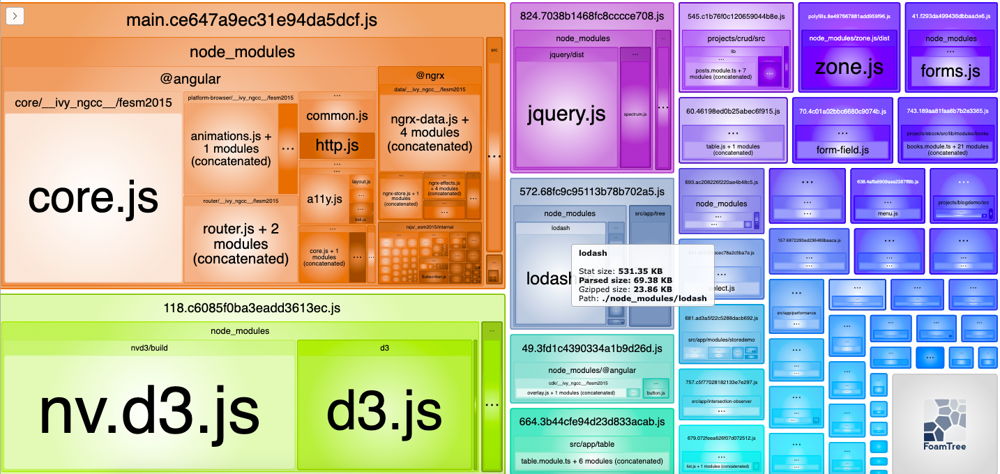
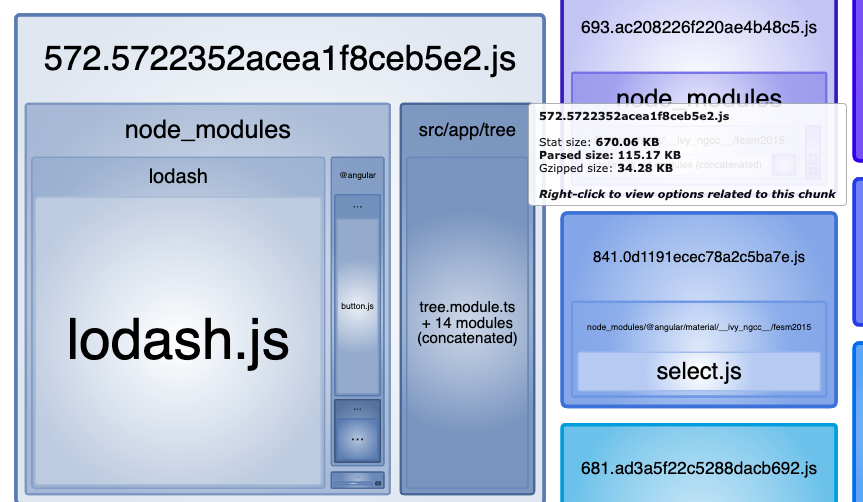
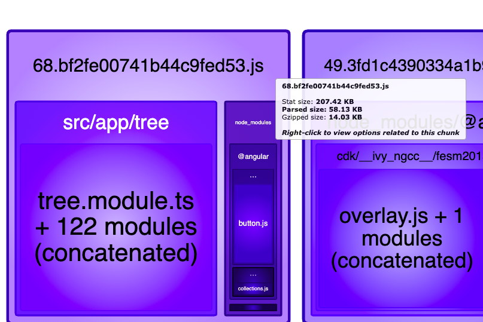
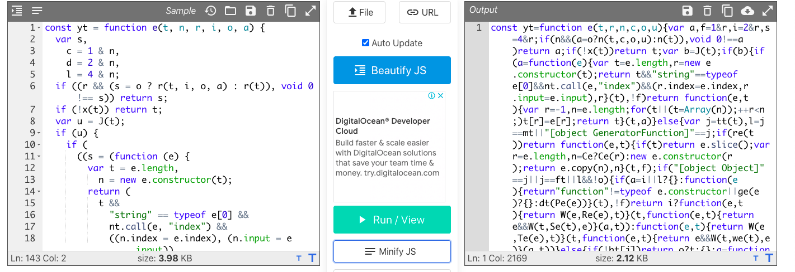

# Lodash

## Before

```
import * as _ from 'lodash';
// also with
import { cloneDeep } from 'lodash';

670.06 - 531.35 = 138.71 ( tree module )
```




```javascript
// Sample
ngOnInit(): void {
  var obj = {
    x: 23,
  };

  // Deep copy
  let deepCopy = _.cloneDeep(obj);
  console.log('HERE', deepCopy);

  console.log('Comparing origianal with' + ' deep ', obj === deepCopy);

  obj.x = 10; // Changing original value

  console.log('After changing original value');

  console.log('Original value ', obj);

  console.log('Deep Copy value ', deepCopy);
}

// Output
HERE {x: 23}
Comparing origianal with deep  false
After changing original value
Original value  {x: 10}
Deep Copy value  {x: 23}
```

## With Lodash ES

```
npm i lodash-es
import cloneDeep from 'lodash-es/cloneDeep';

// use same way
```





```javascript
const yt = function e(t, n, r, i, o, a) {
  var s,
    c = 1 & n,
    d = 2 & n,
    l = 4 & n;
  if ((r && (s = o ? r(t, i, o, a) : r(t)), void 0 !== s)) return s;
  if (!x(t)) return t;
  var u = J(t);
  if (u) {
    if (
      ((s = (function (e) {
        var t = e.length,
          n = new e.constructor(t);
        return (
          t &&
            'string' == typeof e[0] &&
            nt.call(e, 'index') &&
            ((n.index = e.index), (n.input = e.input)),
          n
        );
      })(t)),
      !c)
    )
      return (function (e, t) {
        var n = -1,
          r = e.length;
        for (t || (t = Array(r)); ++n < r; ) t[n] = e[n];
        return t;
      })(t, s);
  } else {
    var h = tt(t),
      p = h == mt || '[object GeneratorFunction]' == h;
    if (re(t))
      return (function (e, t) {
        if (t) return e.slice();
        var n = e.length,
          r = Ce ? Ce(n) : new e.constructor(n);
        return e.copy(r), r;
      })(t, c);
    if ('[object Object]' == h || h == ft || (p && !o)) {
      if (
        ((s =
          d || p
            ? {}
            : (function (e) {
                return 'function' != typeof e.constructor || ge(e)
                  ? {}
                  : dt(Pe(e));
              })(t)),
        !c)
      )
        return d
          ? (function (e, t) {
              return W(e, Re(e), t);
            })(
              t,
              (function (e, t) {
                return e && W(t, Se(t), e);
              })(s, t),
            )
          : (function (e, t) {
              return W(e, Te(e), t);
            })(
              t,
              (function (e, t) {
                return e && W(t, we(t), e);
              })(s, t),
            );
    } else {
      if (!bt[h]) return o ? t : {};
      s = (function (e, t, n) {
        var r,
          i,
          o = e.constructor;
        switch (t) {
          case '[object ArrayBuffer]':
            return it(e);
          case '[object Boolean]':
          case '[object Date]':
            return new o(+e);
          case '[object DataView]':
            return (function (e, t) {
              var n = t ? it(e.buffer) : e.buffer;
              return new e.constructor(n, e.byteOffset, e.byteLength);
            })(e, n);
          case '[object Float32Array]':
          case '[object Float64Array]':
          case '[object Int8Array]':
          case '[object Int16Array]':
          case '[object Int32Array]':
          case '[object Uint8Array]':
          case '[object Uint8ClampedArray]':
          case '[object Uint16Array]':
          case '[object Uint32Array]':
            return (function (e, t) {
              var n = t ? it(e.buffer) : e.buffer;
              return new e.constructor(n, e.byteOffset, e.length);
            })(e, n);
          case '[object Map]':
            return new o();
          case '[object Number]':
          case '[object String]':
            return new o(e);
          case '[object RegExp]':
            return (
              ((i = new (r = e).constructor(r.source, ot.exec(r))).lastIndex =
                r.lastIndex),
              i
            );
          case '[object Set]':
            return new o();
          case '[object Symbol]':
            return st ? Object(st.call(e)) : {};
        }
      })(t, h, c);
    }
  }
  a || (a = new V());
  var f = a.get(t);
  if (f) return f;
  a.set(t, s),
    pt(t)
      ? t.forEach(function (i) {
          s.add(e(i, n, r, i, t, a));
        })
      : ut(t) &&
        t.forEach(function (i, o) {
          s.set(o, e(i, n, r, o, t, a));
        });
  var m = u ? void 0 : (l ? (d ? Be : Fe) : d ? Se : we)(t);
  return (
    (function (e, t) {
      for (
        var n = -1, r = null == e ? 0 : e.length;
        ++n < r && !1 !== t(e[n], n);

      );
    })(m || t, function (i, o) {
      m && (i = t[(o = i)]), Q(s, o, e(i, n, r, o, t, a));
    }),
    s
  );
};
```

## Demo

No Lodash

```
Table - 117.03KB
Performance - 26.94KB
Tree: 138.17KB
```

Lodash ES

```
Table - 117.03KB / 117.64KB
Performance - 26.94KB / 27.55KB
Tree: 138.17KB / 138.73KB

+ lodash_es

68.69KB
```

With Lodash

```
Table - 117.63KB
Performance - 27.54KB
Tree: 138.72KB

+  Lodash bundle

531.35KB
```
