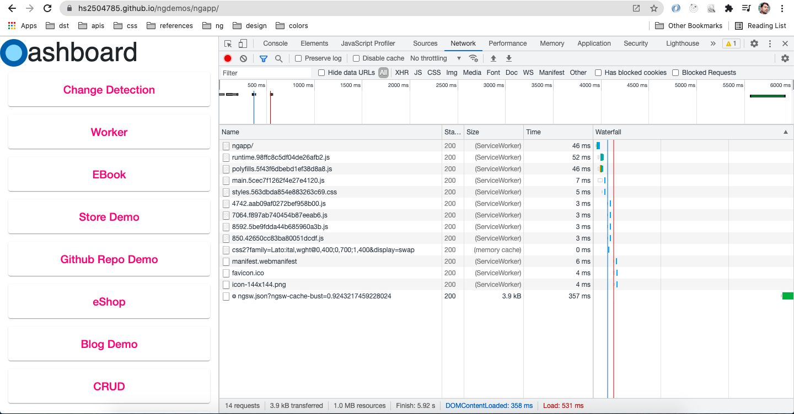

# Optimize Network

## Cache static content using Angular PWA

- Cache static content css, images, js



```
ng add @angular/pwa --project ngapp

ng build --prod
cd dist/ngdemos
live-server
```

## Cache http calls with Angular PWA

- Cache previous http request to provide faster response
- Balance freshness and performance

| Freshness                                                                           | Performance                                                            |
| ----------------------------------------------------------------------------------- | ---------------------------------------------------------------------- |
| Always get newest from server, but fallback to cache if not returned within timeout | Get from the cache 1st and than make http request and update the cache |
| Used for the data that change often, and where freshness is important               | Used for data that changes rarely                                      |
| fressness                                                                           | Used for offline app                                                   |
