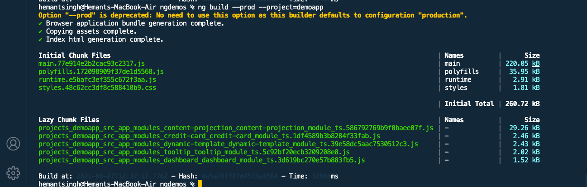
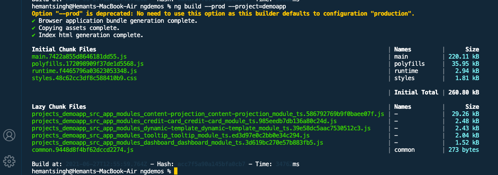

# Using Shared

I have created a shared module with...

- credit card directive
- tooltip directive
- myFor directive

## Case 1

Imported directive independently in resppective modules..

TooltipModule - just use 1 directive myFor
CreditCardModule - use 2 directive tooltip & creditCard

## Case 2

Imported SharedModule in resppective modules..

TooltipModule - just use 1 directive myFor
CreditCardModule - use 2 directive tooltip & creditCard

## Findings

Although Angular manage things pretty well whaen we include complete SharedModule, for example TolltipModule just need myFor directive but included SharedModule that have all directives, but in generated bundle it have only myFor directive, Great job webpack/Angular

but still their are some increase in bundle size, than including each directive independently.

## Takeaway

Use SharedModule when all places all included pieces are used. Better always prefer to load required things( directives, pipes, components etc)
