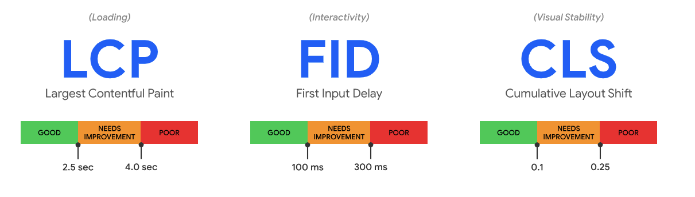
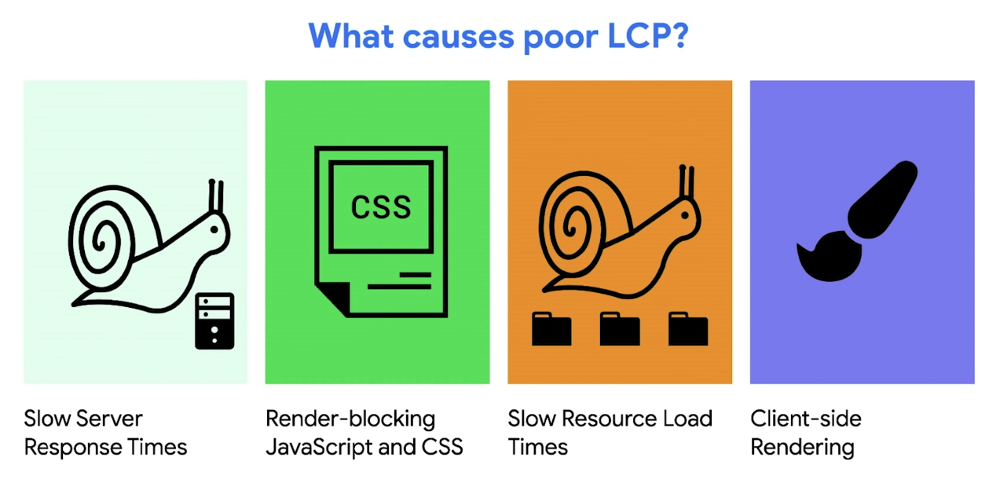
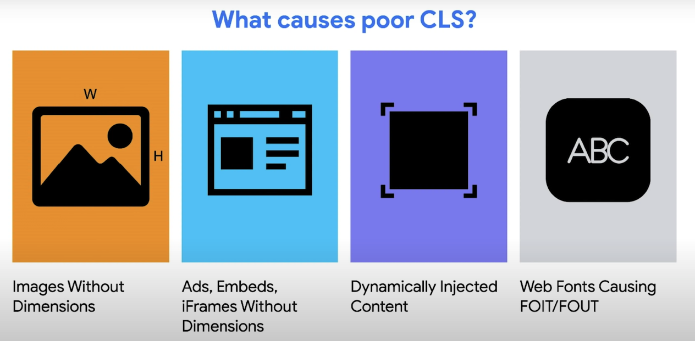

# Web Vitals

Core web vitals

https://web.dev/vitals/?gclid=CjwKCAjwr56IBhAvEiwA1fuqGsj6DJG01QRsSA-bXOPpQqJSBodgrSbVIsPKgGTc0ki6CSAe2Yt2sxoCvB8QAvD_BwE

- LCP should occur within 2.5 seconds of when the page first starts loading.
- pages should have a FID of 100 milliseconds or less.
- To provide a good user experience, pages should maintain a CLS of 0.1. or less.



## Measure Web Vital

```
npm install web-vitals -D
```

### Measure LCP in JavaScript

```javascript
// app.component.ts
import {getLCP, getFID, getCLS} from 'web-vitals';

constructor() {
  getCLS(console.log);
  getFID(console.log);
  getLCP(console.log);
}
```

## How to improve LCP




- Defer JS with lazy loading
- use critical css and defer remaining css
  https://web.dev/extract-critical-css/

## CLS



- always include width and height attribute size on image and video element
- reserve enough space for dynamic content
- avoid inserting content on top of existing content

```html
<!-- Markup -->

```

```css
/* CSS */
img {
  width: 100%;
}
```

## aspect ratio

https://web.dev/aspect-ratio/

In case dimension is not known use aspect ratio...

Using aspect-ratio creates a placeholder to prevent this layout shift:

```css
img {
  width: 100%;
  aspect-ratio: 8 / 6;
  object-fit: contain;
}
```
