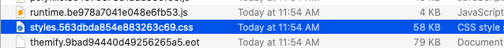

# UNCSS

```
ng build
npm run purgecss
```

## eBook module implementation with uncss





# App Uncss

```
npm run ngappdeploy
npm run criticalCss
```

1. Uncss - remove dead ( unused css ) from styles.326467264244324.css
2. coveragecss - split #1 css into critical css + lazy css

```
// run build, postbuild(uncss)
npm run ngappdeploy

// split styles.3247328473244.css into critical css ( used css ) and lazy (unused css)
// and appends critical css into html
// also update styles.3247328473244.css with unused css
// as of now it use source prod url 
npm run criticalCss
```


